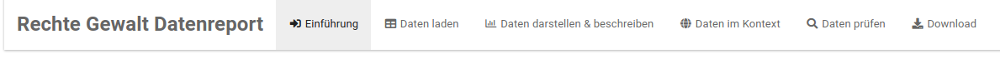
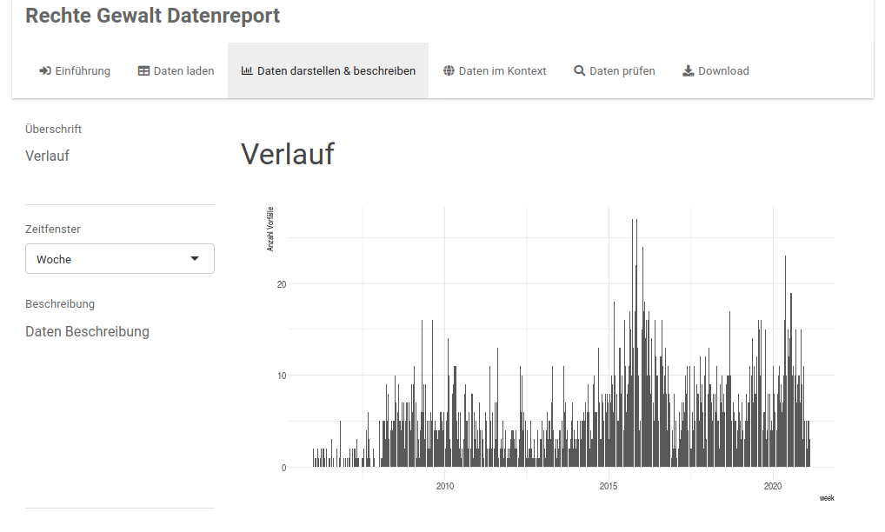
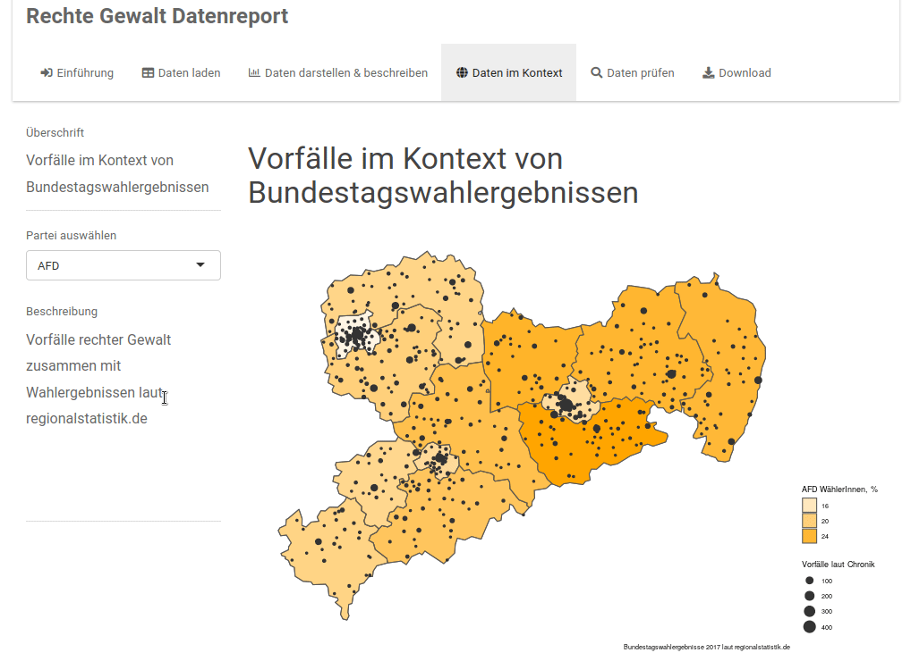
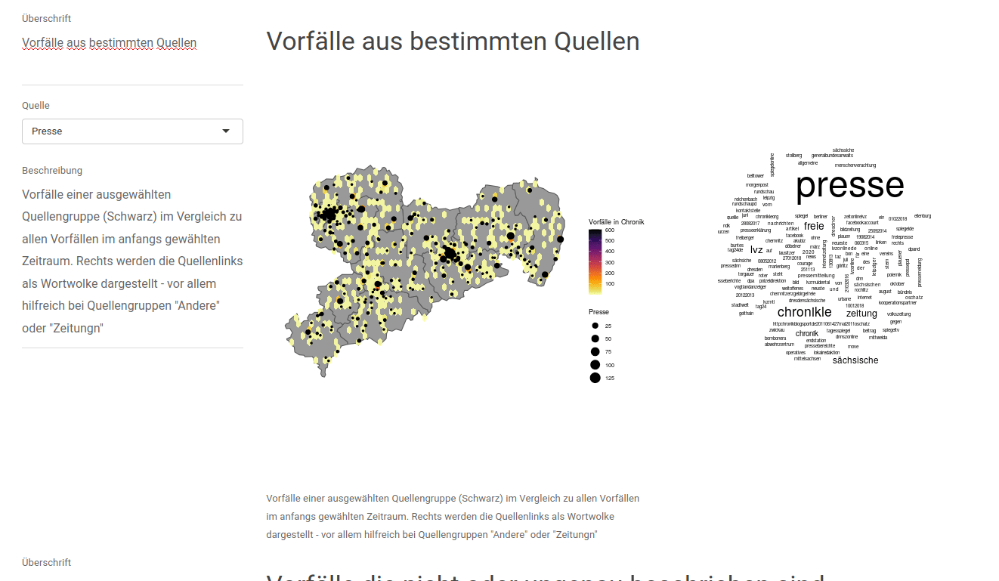

# (PART) Usage {-}

# Using Rightwatching {#usage}

The current version of rightwatching is accessible [here](https://app.rightwatching.org) behind a login. Write to [info@rightwatching.org](mailto:info@rightwatching.org) to get access. We use a login for two reasons: 

* The app is intended for people working on far-right violence.
* We have limited resources and try to prevent abuse. 

**This tool uses data from counseling organisations for victims of far-right violence. These organisations are in now way responsible for the methodology or structure of this tool.**

## Structure

The app has 6 panels: 

* An introduction with information about data sources,
* **Load Data** lets you select the chronicle and time frame,
* **Data Visualization** to return simple charts about time and place of far-right violence,
* **Data in Context** puts violent incidents side-by-side external data. This section can be used to test hypotheses. 
* **Data Verification** allows to inspect the data and its sources - mainly to ensure data quality. 
* **Download** to generate a report out of the previous steps. **You first need to run through all other tabs** to be able to generate the report. 

## Data Loading

The data comes from [tatortrechts.de](https://tatortrechts.de). They obtain the data from chronicles, wrangle and clean the incidents and we pick them up from their endpoint. Do not expect new incidents in a chronicle to appear immediately in this app. 

You should select an organization and press the loading button. This will return the raw data in a large table and provide you with a short summary on top. If you adjust the date filter (for example to prepare an annual report), the summary should also adjust. In case you would like to work with the data on your computer in a spreadsheet program, you can download the table as .tsv file. Proceed to the next tab. 

## Data Visualization

You are presented a simple histogram where you can adjust the time granularity; weekly, monthly, yearly. 

To give an idea about geographic distribution, you can select districts in the line charts. By default all districts are shown - which can take some time to generate when working on a large federal state. 

## Data in Context

This section gives you four maps, to show far-right violence next to other data of interest:

* voting results from the 2017 Bundestags election (you can select the party you wish to see, small parties are unfortunately summarised as "Other" in the original dataset from regionalstatistik.de); 
* population density; 
* percentage of foreign population; 
* voting percentage for NSDAP party in 1933. 

## Data Verification

This section helps you probe and check your data. A map shows you the different source groups and from where each source group reports incidents. An interactive map allows you to see incidents from a specific source together with total incidents. Since we categorize the sources ourselves based on keywords, we show you the original source names as wordcloud. 

The source classification [happens here](https://github.com/chris-toph-t/rightwatching-shiny-app/blob/main/data-raw/prepare.R).  

You will also find a chart showing you missing values. This is important since missing values mean inaccurate data visualizations. The table shows you all incidents from your chronicle that do not have a city specified. 

## Report Download

Based on all entries you have made before - including selections and custom header texts - you can download a report with all charts. Report generation will take a while. 

