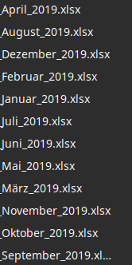
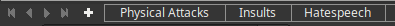

# Wrangle {#wrangle}

This chapter shows how to get incident data into a tidy data format: each row is one incident (observation), each column is one attribute of the incident (variable). Incident data can be a tricky to get tidy. 

**Terminology**: the dataframe with incidents is referred to as chronicle throughout this documentation. 

```{r}
library(librarian)
shelf(knitr, 
      viridis, 
      #openxlsx,
      gganimate,
      giscoR,
      jsonlite,
      hrbrthemes, 
      sf,
      readxl,
      rnaturalearthdata,
      rvest,
      #tesseract,
      tidyverse, 
      lib = lib_paths()[1])
```


## Import incidents

### Regular Import

In most (lucky) cases you have your incidents in an Excel file or you can grab them from a json API. You can use the packages readxl and jsonlite to get this data into R or RStudio, refer to the respective documentation for these standard cases.

For this book we use a dataframe of incidents in CSV format, looking like this: 

```{r, echo=FALSE}

chronicle <- readr::read_csv(file.path("data", "dummy_chronicle.csv"))

knitr::kable(
  tail(select(chronicle, date, description, url, city, state, source_name), 5), caption = 'Your list of incidents may look like this'
)
```


After this chapter, you will have a dataframe of incidents looking like this:

```{r}
library(knitr, readr)
chronicle <- readr::read_csv(file.path("data", "dummy_chronicle.csv")) 
knitr::kable(
  tail(select(chronicle, date, description, url, city, state, longitude, latitude, source_name, source_group), 5), caption = 'Your list of incidents could look like this later'
)
```

This was the easy case. For all other more complex cases, read on. 


### Incidents in nested Excel files

This example illustrates how to get incidents into a dataframe out of an Excel file: the example uses one Excel workbook for each month of incidents and in each workbook, different categories are in each sheet. 

* So your folder with the data would look like this: 
* And in each file you would have the same sheets like this: 

Specify the path of your Excel files, the function returns all sheets and files into one single dataframe. 

```{r, eval=FALSE}

unnest_sheets <- function(directory = "./data") {
  

  datafiles <- list.files(directory, full.names = TRUE)
  chronicle <- tibble()
  
  for (i in 1:length(datafiles)) {
    #open each monthly file
    datasheets <- readxl::excel_sheets(datafiles[i])
    
    for (j in 1:length(datasheets)) {
      # loop through each thematic sheet in each file
      sheet <- read_excel(path = datafiles[i], sheet = datasheets[j], skip = 2) %>%
        janitor::clean_names() %>%
        #categorical information is not stored in the excel sheet itself but in the sheet name
        mutate(category = datasheets[j]) %>%
        #the filename would contain the month of the incident
        mutate(datafile = datafiles[i])
      chronicle <- rbind(chronicle, sheet)
    }
    message("reading now ", datafiles[i])
  }
  return(chronicle)
}
```


### Images in Excel Files

When violent incidents monitor online hate speech, watchdogs are tempted to document hate speech incidents as screenshots in an Excel file. This function gets these png images and performs basic optical character recognition.

For this to work you need openxlsx and tesseract installed as R packages and their dependencies on your system. 

```{r, eval=FALSE}
# the package readxl will not allow us to get PNG images, but openxlsx will

get_images <- function(filepath = NULL) {
  wb  <- openxlsx::loadWorkbook(filepath)
  # creating a list of png images found in the workbook
  imagelist <- tibble(location = wb$media) %>%
     filter(str_detect(location, ".png$"))
  text <- tibble()
  #loop through each image in every file
  for (k in 1:length(imagelist$location)) {
    #read image from excel and save temporarily
    png::writePNG(png::readPNG(imagelist$location[k]), "img.png")
    #perform OCR for German on image
    extract <- tesseract::ocr("img.png", engine = tesseract("deu"))
    tibble(text = extract) %>%
      mutate(origin = filepath) %>%
      mutate(imageindex = k) -> text
    rbind(text, texts) -> texts
  }
  return(texts)  
}


```

The accuracy of OCR depends on image resolution and deteriorates greatly if heavy dialect is used. 


### Incidents in wesites

Often, your incidents are locked in an html table on a website. Use rvest and htmltools to extract this data. This function will loop through each page where you have incident data and get it from there. You need to adjust 

* the URL. Ensure that it ends with a page parameter, like `page=1`
* maxpages. The number of total pages. 
* The css selector of the payload and all css selectors for your incidents. You can get these with inspect element in your browser. 


```{r eval=FALSE}

page_scrape <- function(url = NULL, maxpages = NULL) {
  chronicle <- tibble()
  for (i in 1:maxpages) {
    doc <- read_html(paste0(url, i))
    #define parent node where all incidents are inside
    payload <- html_nodes(doc, css = ".view-content")
  
    date <- payload %>%
      html_nodes(.,css = ".date-field") %>%
      html_text() %>%
      trimws()
    names(date) <- "date"
    
    title <- payload %>%
      html_nodes(.,css = ".views-field-title") %>%
      html_text() %>%
      trimws()
    names(title) <- "title"
    
    descr_text <- payload %>%
      html_nodes(.,css = ".views-field-body") %>%
      html_text() %>%
      trimws()
    names(descr_text) <- "descr_text"
    
    place <- payload %>%
      html_nodes(.,css = ".views-field-chronicle-place") %>%
      html_text() %>%
      trimws()
    names(place) <- "place"
  
    
    source_links <- payload %>%
      html_nodes(.,css = ".views-field-chronicle-source") %>%
      html_text() %>%
      trimws()
    names(source_links) <- "source_links"
    
    
    temp <- tibble(title, date, descr_text, place, source_links)
    chronicle <- rbind(chronicle, temp)
    message(i)
    Sys.sleep(runif(1, min = 1, max = 2))
  }
  return(chronicle)
}


```

### Get administrative boundaries {#adminboundaries}

Later chapters of this book will create maps out of incidents. To add administrative boundaries as baselayer to these maps, we will get shapes of one sample region through GiscoR. 

```{r, eval=TRUE}

# for admin boundaries underneath the incidents we need the shape of admin boundaries. 
# this gets county admin levels for Germany
admin_boundaries <- giscoR::gisco_get_nuts(nuts_level = "3", 
                                           country = "DEU", resolution = "03", cache = TRUE, update_cache = TRUE) %>%
      # select counties of only one federal state
      filter(str_detect(NUTS_ID, "DE2"))
```


## Clean incidents {#clean}

Now we have covered three basic ways of getting your incidents into R. You would have a dataframe now with dates, places, descriptions, perhaps sources and other categories about your incidents. Most likely your dates will still be a character. For this, we'll need to clean the data. 

### Extract dates

For histograms and other time-series visualizations, you should extract different date granularities. Lubridate allows to easily extract dates from strings. 

```{r, eval=FALSE}

chronicle <- chronicle %>%
  # for dates in format day month year 
  mutate(date = as.Date(lubridate::dmy(date))) %>%
  mutate(week = as.Date(cut.Date(date, breaks = "week"))) %>%
  mutate(month = as.Date(cut.Date(date, breaks = "month"))) %>%
  mutate(year = as.Date(cut.Date(date, breaks = "year")))
  
```


### Source classification

Some organisations collecting violent incidents keep source urls in a column. For this example, we have a source column with rows like this: `Source:   https://www.newspaper.com/article-about-incident-1`. We want to keep only the top-level domain (newspaper.com) as source_name and then roughly categorize these names into source_group, like "Press", "Police Report", etc.  


```{r, eval=FALSE}
chronicle_clean <- chronicle %>%
  # remove the Source string from each string
  mutate(source_links = str_remove(source_links, "Source:\\s{3}")) %>%
  # extract top level domain out of source link and remove www
  mutate(source_name = str_remove(str_extract(source_links, "//.*?(/|$)"), "(//www.|//)")) %>%
  # classify sources based on extracted top level domain
  mutate(source_group = case_when(grepl("presseportal", source_name, ignore.case = TRUE) ~ "Police Press Portal",
                                  grepl("kleineanfrage|bundestag", source_name, ignore.case = TRUE) ~ "Freedom of Information Requests",
                                  grepl("antifa", source_name, ignore.case = TRUE) ~ "Antifa",
                                  # large regexp to match different newspaper options, check this thoroughly for your case
                                  grepl("rundschau|taz|zeitung|allgemeine|anzeiger|news|bote|post|chronik|spiegel", 
                                        source_name, ignore.case = TRUE) ~ "Newspapers",
                                  TRUE ~ "Others"
  ))
```


### Geocoding {#geocode}

Geocoding is a complex task. These three steps only cover the very basics. 

* First we add our parent geographic entity to the places in the incident table
* Then we define a function to ask Openstreetmap Nominatim for coordinates and admin levels. If Openstreetmap is not very complete in your country, consider other providers. 
* Finally we run the function on all places. 

```{r, eval=FALSE}
# if you have incidents only from Berlin, narrow down the query results by providing the administrative entity 
chronicle_clean <- chronicle_clean %>%
  mutate(placestring = paste0(place, "+Berlin")) 
```


To speed up the geocoding, you can use your own dockerized Nominatim instance [from here](https://github.com/mediagis/nominatim-docker/) and point  src_url in the function to your own instance. 


```{r, eval=FALSE}

#define geocoding function
geocode <- function(place = NULL){
  # NOMINATIM SEARCH API URL
  # use this one if you don't have your own docker nominatim instance
  src_url <- "https://nominatim.openstreetmap.org/search?q="
  #src_url <<- "http://nominatim.geocode:8080/search?q="
  # if more than one field per address, concatenate here
  addr <- place
  request <- paste0(src_url, addr, "&format=geocodejson&addressdetails=[1]")
  if(suppressWarnings(is.null(addr)))
    return(data.frame())
  # transformNomiatim response to json
  response <- 
    tryCatch(
      fromJSON(html_text(html_node(read_html(request), "p"))), 
    error = function(c) return(data.frame())
    )
  # Get lon, Lat, Admin6, admin4 from response
  if (length(response$features$geometry$coordinates[[1]][1]) == 0) {
    lon <- NA
  }
  else {
    lon <- response$features$geometry$coordinates[[1]][1]  
  }
  if (length(response$features$geometry$coordinates[[1]][2]) == 0) {
    lat <- NA
  }
  else {
    lat <- response$features$geometry$coordinates[[1]][2]  
  }
  if (length(response$features$properties$geocoding$admin$level6[[1]]) == 0) {
    admin6 <- NA
  }
  else {
    admin6 <- response$features$properties$geocoding$admin$level6[[1]]  
  }
  if (length(response$features$properties$geocoding$admin$level4[[1]]) == 0) {
    admin4 <- NA
  }
  else {
    admin4 <- response$features$properties$geocoding$admin$level4[[1]]  
  }
  return(data.frame(lat,lon,admin6, admin4))
}

```

Running this geocode() function on all incidents will take some time and means you will send duplicate queries. If this is an issue, especially when using the public Nominatim instance or paid providers, you  should dplyr::summarise() and dplyr::group_by() before. Then you will only geocode unique places.

```{r, eval=FALSE}
for (i in 1:nrow(chronicle)) {
  result <- geocode(chronicle_clean$placestring[i])
  chronicle_geocoded$lat[i] <- result$lat
  chronicle_geocoded$lon[i] <- result$lon
  chronicle_geocoded$admin6[i] <- as.character(result$admin6)
  Sys.sleep(1.5)
  message(i)
}
```


