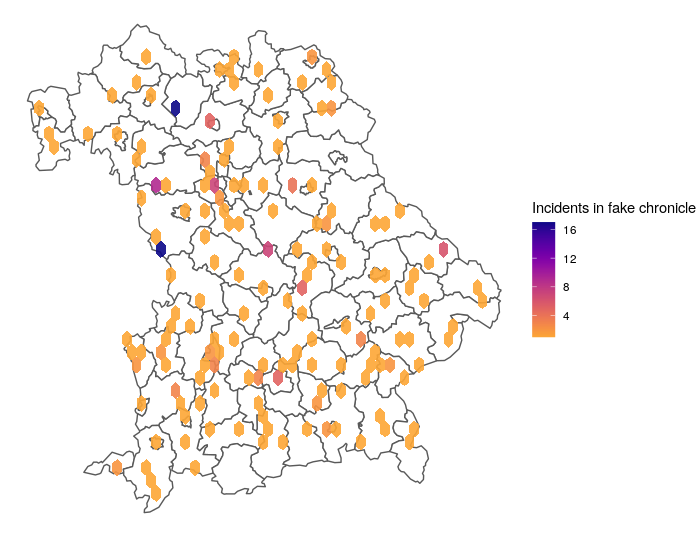
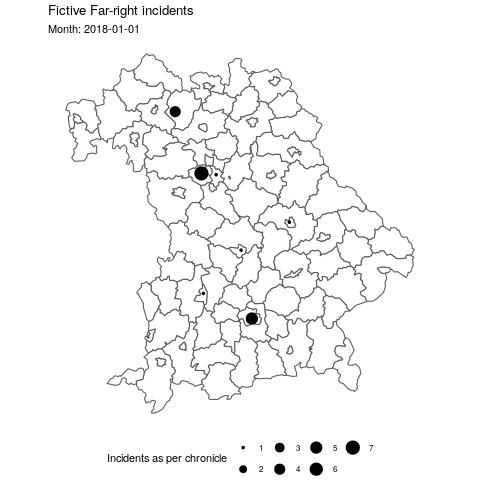

# Visualize Incidents {#visualize}

## Histogram

For a quick glimpse, let's visualize incidents across time. make_histogram() takes two arguments: the data to be used and the level of date granularity, i.e. the columns created previously for week, month, year.  

```{r, eval=TRUE, echo=FALSE}
chronicle %>%
  ggplot(aes(x=month)) +
  geom_bar() +
  scale_x_date() +
  theme_ipsum() +
  labs(y = "Number of fake incidents", x = "Month") 
```


## Hexbin Map

Once each incident has a latitude and longitude as describes in the \@ref(geocode) chapter, you can plot the density of incidents on map. The admin_boundaries are obtained using the GiscoR package, like here \@ref(adminboundaries). You do not need to aggregate your incidents - stat_bin_hex will do this automatically for you. 

```{r, eval=TRUE}

hexbin <- ggplot() +
  geom_sf(data = admin_boundaries, fill = "White") +
  stat_bin_hex(data = chronicle, aes(x = lon, y = lat, fill = ..count..), alpha = 0.9, binwidth = 0.1) +
  scale_fill_viridis(option = "C", direction = -1, end = 0.8) + 
  labs(fill = "Incidents in fake chronicle") +
  theme_void()


```




## Animated Map

Our incidents have time and place. Using an animated map, we can visualize both. Check the documentation of the `gganimate` package. It allows to generate gifs and videos. 

```{r, eval=FALSE}

animated_map <- chronicle %>%
  group_by(placestring, lat, lon, month) %>%
  summarise(n = n()) %>%
ggplot() +
    geom_sf(data = admin_boundaries, fill = "White") +
    geom_point(aes(x = lon, y = lat, size = n)) +
    scale_fill_viridis(option = "C", direction = -1, end = 0.8) + 
    theme_void() +
    theme(legend.text  = element_text(size = 8),
          legend.key.size = unit(1.5, "lines"),
          legend.position = "bottom", legend.box = "horizontal") +
  transition_time(month) +
  labs(title = "Fictive Far-right incidents", subtitle = "Month: {frame_time}", size = "Incidents as per chronicle") 


gganimate::anim_save(file.path("images", "animated.gif"), animated_map)

```




