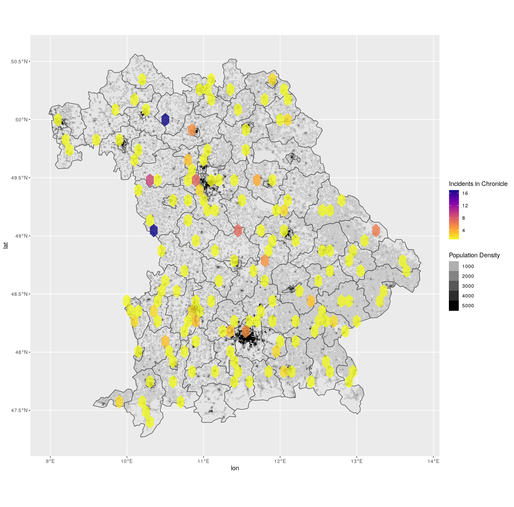
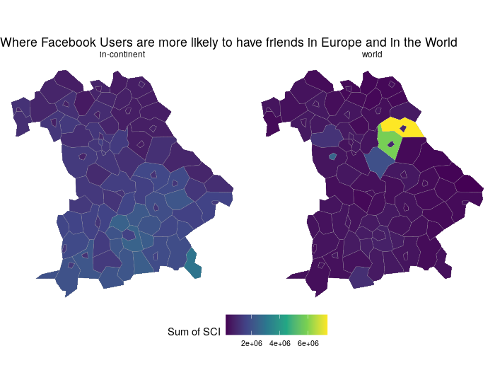
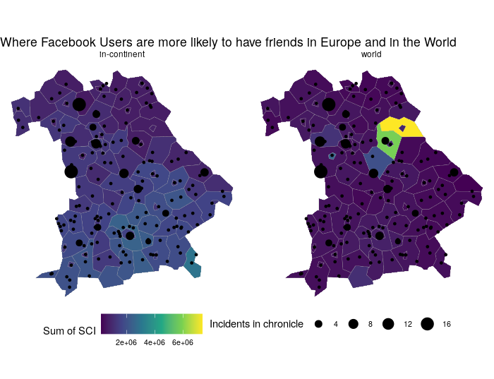
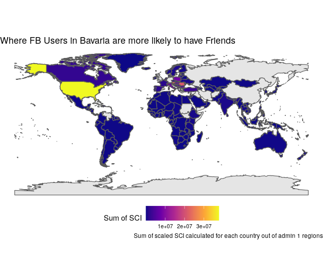
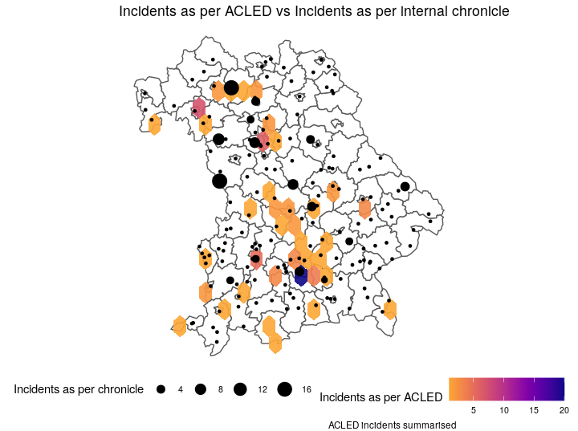

# Contextualize

## Getting external data

Incidents of violent events rarely occur alone. They are part of a society, a political climate or an armed conflict. Comparing incidents with other data can help testing hypothesis - that may potentially save lives. A few examples:

* A party to an armed conflict uses heavy weaponry in densely populated areas. Looking at these incidents together with population density may reveal a pattern or help prove an intention. 
* Violence against a minority may occur in places where a particular party gains high votes. 
* Outbreaks of violence may have something to do with road accessibility in harsh weather conditions of a specific season. 

Do not confuse correlation and causation. 

The purpose of this chapter is to give the right pieces of information to people who need to decide about actions (humanitarian interventions, counselling activities for victims of racist violence). These decision-makers base their decisions on evidence - and a wide vision of the context is usually helpful. 


## Examples fo external data

* Geospatial data
  * GiscoR population density grids
  * Facebook social connectedness.
* ACLED Data: since early 2021, the Armed Conflict Location & Event Data Project [has expanded coverage to Europe](Armed Conflict Location & Event Data Project). 


## Mapping Populalation Density (Europe)

For Europe, population density data can be obtained from EU's GISCO. This script downloads a zip file, unzips it and places the contents in a data directory below your current RProj directory. 

```{r, eval=FALSE}
# adjust resolution to 1 if you have bandwidth and disk space
pop_grid <- giscoR::gisco_get_grid(resolution = 5)

# filtering for admin region of interest, DE2 here. 
pop_grid_filtered <- pop_grid %>%
  filter(NUTS2016_0 == "DE") %>%
  filter(NUTS2016_1 == "DE2")
    
```

With the grid loaded, we can proceed and plot population density below our geocoded incidents:

```{r, eval=FALSE}

ggplot() +
  geom_sf(data = admin_boundaries) +
  # population density is mapped to transparency here, 
  # otherwise you cannot have two different fill color scales
  geom_sf(data = pop_grid_filtered, aes(alpha = TOT_P_2011), fill = "black", lwd=0) +
  stat_bin_hex(data = chronicle, aes(x = lon, y = lat, fill = ..count..), alpha = 0.8, binwidth = 0.1) +
  scale_fill_viridis(option = "C", direction = -1) +
  labs(alpha = "Population Density", fill = "Incidents in Chronicle")

```

In this example below we have introduced a cap of 5000 on population density. Solid black therefore represents 5000 and above - otherwise sparsely populated places would not appear. This chart would help to check if your incidents are an urban phenomenon



If you're reproducing this map for incidents outside of Europe, check the datasets from [Worldpop](https://www.worldpop.org/)

## Mapping Facebook Social Connectedness Index

This book is primarily written to help analyze data on racist and right-wing violence. When looking at such incidents in a region, it can be insightful to see where facebook users in this region have friends, i.e. using facebook friendships as a proxy for openness and connectedness. Facebook publishes this data in the form of social connectedness index. 

Head to the [humanitarian data exchange](https://data.humdata.org/dataset/social-connectedness-index), download the dataset gadm1_nuts3_counties_gadm1_nuts3_counties and unzip. 

```{r, eval=FALSE}
library(giscoR, tidyverse)
giscoR::gisco_get_nuts(nuts_level = "3",   
                       year = "2016",
                       epsg = "3035",
                       resolution = 20) -> nuts

connectedness <- readr::read_tsv(file.path("data", "facebook_sci_DE.tsv"))

```

### Likelihood to have friends outside of Europe

The dataset has three columns: the NUTS ID of the user, the NUTS ID of the friend and the social connectedness index between the two. We are interested in computing how likely are people from one specific area (like a federal state) to have friends 

* in the same country?
* in another European country?
* in the world? 


```{r, eval=FALSE}
library(sf, tidyverse)

# filter to administrative region of interest
connectedness_regional <- connectedness %>%
  filter(str_detect(user_loc, "^DE2"))

# classify friend location in three groups and summarise by these and user location
regional_summary <- connectedness_regional %>%
  mutate(fr_country = str_extract(fr_loc, "^[A-Z]{2}")) %>%
  mutate(fr_category = case_when(fr_country == "DE" ~ "in-country",
                                 fr_country %in% eu_list ~ "in-continent",
                                 TRUE ~ "world"
                                 )) %>%
  group_by(user_loc, fr_category) %>%
  summarise(sum_scaled_sci = sum(scaled_sci))


```

This will yield a shorter table, where each administrative unit of our users only appears three times. The numeric value of sum_scaled_sci is less less telling here - it only serves as indicator. Check the [guidance note](https://data.humdata.org/dataset/social-connectedness-index) on how the SCI is calculated. 


```{r, eval=FALSE}

nuts_regional <- nuts %>% 
  filter(str_detect(NUTS_ID, "^DE2")) %>%
  left_join(regional_summary, by = c("NUTS_ID" = "user_loc"))


friends_in_world <- nuts_regional %>%
    # remove in-country category 
    filter(fr_category != "in-country") %>%
    ggplot() +
    geom_sf(aes(fill = sum_scaled_sci, group = fr_category), colour="#ADADAD", size=0.1) +
    #stat_bin_hex(data = chronicle, aes(x = lon, y = lat, fill = ..count..), alpha = 0.9, binwidth = 0.1) +
    labs(fill = "Sum of SCI", title = "Where Facebook Users are more likely to have friends in Europe and in the World") +
    theme_void() +
    scale_fill_viridis_c() +
    theme(legend.text  = element_text(size = 8),
          legend.key.size = unit(1.5, "lines"),
          legend.position = "bottom", legend.box = "horizontal") +
    facet_wrap(~fr_category)


```



And this is how you can spot a US military training compound in Facebook data. 

With a bit of tweaking our incident data, we can plot the incident locations on top of the choropleth. 

```{r, eval=FALSE}
chronicle_sf <- chronicle %>%
  # use this with caution: some incidents have not been geocoded properly and have empty lat/lon
  filter(!is.na(lon)) %>%
  st_as_sf(coords = c("lon", "lat"), crs = 4326) %>%
  group_by(placestring) %>%
  summarise(n = n())


friends_in_world +
  geom_sf(data = chronicle_sf, aes(size = n)) +
  labs(size = "Incidents in chronicle")
```




### Where they have friends

In order to see where facebook users in our region of interest have friends we need to aggregate the `fr_loc` column by country. Since the `fr_loc` column contains different coding levels (nuts3 for Europe, counties for US, GADM for most countries) we need to insert the code type and then extract the first 2 or 3 letters to get country codes. 

We then summarise the social connectedness index again by summing it for each country - perhaps not the most meaningful number for a relative probability. 

We use the `rnaturalearthdata::countries50` dataset as shapes for world countries. 

```{r, eval=FALSE}
# Get the counties level reference table from HDX
# https://data.humdata.org/dataset/social-connectedness-index
fb_admin <- read_csv(file.path("data", "gadm1_nuts3_counties_levels.csv"))

world_summary <- connectedness_regional %>%
  left_join(fb_admin, by = c("fr_loc" = "key")) %>%
  # extract first 2 or 3 letters, depending on administrative code used
  mutate(fr_country = case_when(level %in% c("country", "county", "gadm1", "gadm2") ~ str_extract(fr_loc, "^.{3}"),
                                level %in% c("nuts3") ~ str_extract(fr_loc, "^.{2}"),
                                TRUE ~ str_extract(fr_loc, "^.{2}")
                                )) %>%
  group_by(fr_country) %>%
  # exclude other regions of Germany
  filter(fr_country != "DE") %>%
  # this sums the SCI for each country out of its admin regions. 
  # Note, this may introduce a bias for countries with many admin regions
  summarise(sum_scaled_sci = sum(scaled_sci))

# join fr_countries with ISO3 
countries1 <- world_summary %>%
  filter(str_length(fr_country) == 3) %>% 
  right_join(st_as_sf(rnaturalearthdata::countries50), by = c("fr_country" = "iso_a3")) %>%
  filter(!is.na(sum_scaled_sci)) %>%
  select(-iso_a2) %>%
  st_as_sf()

# join fr_countries with ISO2 
countries2 <- world_summary %>%
  filter(str_length(fr_country) == 2) %>% 
  right_join(st_as_sf(rnaturalearthdata::countries50), by = c("fr_country" = "iso_a2")) %>%
  filter(!is.na(sum_scaled_sci)) %>%
  select(-iso_a3) %>%
  st_as_sf()

countries <- rbind(countries1, countries2)
```

This will get us a simple feature object of all world countries and how likely people from our region of interest are to have friends there. 


```{r, eval=FALSE}
ggplot()+
  theme_minimal()+
  geom_sf(data = st_as_sf(rnaturalearthdata::sovereignty50), size = 0.4) +
  geom_sf(data = countries, aes(fill = sum_scaled_sci), size = 0.5)+
  #geom_segment(data = , aes(x = 11.338, xend = LAT, y = 49.545, yend = LON), col = "red")
  labs(fill = "Sum of SCI", title = "Where FB Users in Bavaria are more likely to have Friends", caption = "Sum of scaled SCI calculated for each country out of admin 1 regions") +
  theme_void() +
  scale_fill_viridis_c(option = "C") +
  theme(legend.text  = element_text(size = 8),
        legend.key.size = unit(1.5, "lines"),
        legend.position = "bottom", legend.box = "horizontal") 
```





## Armed Conflict Data


ACLED data is well coded, freely available (though you need  token) and has a solid methodology. [Since January 2021](https://acleddata.com/2021/01/14/acled-expands-to-all-of-europe/) ACLED also covers the whole of Europe, monitoring armed conflict, social movements, political violence. 


```{r, eval=FALSE}
acled_events <- jsonlite::read_json("https://api.acleddata.com/acled/read?key=Your-API-Key&email=Your-Registration-Email&country=Germany", simplifyVector = TRUE)
acled_events <- acled_events$data

acled_regional <- acled_events %>%
  filter(admin1 == "Bayern (Bodensee)") %>%
    # ensure R takes date as date
  mutate(event_date = lubridate::ymd(event_date)) %>%
  #make sure numbers are numbers
  mutate(latitude = as.numeric(latitude)) %>%
  mutate(longitude = as.numeric(longitude)) %>%
  mutate(fatalities = as.numeric(fatalities)) %>%
  mutate(week = as.Date(cut(event_date, breaks = "week"))) 


chronicle %>%
  group_by(placestring, lat, lon) %>%
  summarise(n = n()) %>%
ggplot() +
    geom_sf(data = admin_boundaries, fill = "White") +
    stat_bin_hex(data = acled_regional, aes(x = longitude, y = latitude, fill = ..count..), alpha = 0.9, binwidth = 0.2) +
    geom_point(aes(x = lon, y = lat, size = n)) +
    scale_fill_viridis(option = "C", direction = -1, end = 0.8) + 
    theme_void() +
    theme(legend.text  = element_text(size = 8),
          legend.key.size = unit(1.5, "lines"),
          legend.position = "bottom", legend.box = "horizontal") +
  labs(title = "Incidents as per ACLED vs Incidents as per internal chronicle", fill = "Incidents as per ACLED", size = "Incidents as per chronicle", caption = "ACLED incidents summarised ") 

```



