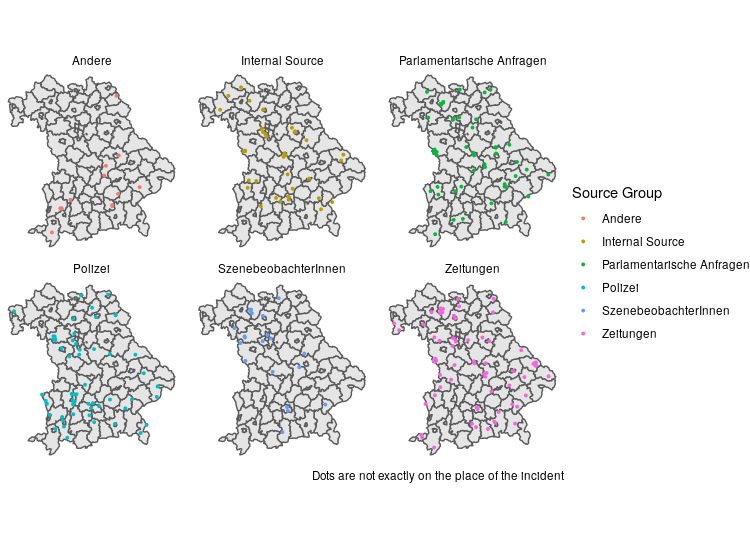

# Verify Data {#verify}

## Checking for NA values

Especially when you obtained your incidents from web scraping and subsequent geocoding, you may encounter missing values in your chronicle. The package **visdat** provides an easy way to visualize those cases. 

```{r, eval=FALSE}
library(visdat)


vis_miss(chronicle) +
    labs(y = "Incidents", caption = "Incidents with missing values", x = "Variables")

```


## Compare your incidents with another source

To enhance your incident coverage it often makes sense to compare these with another external source. This snippet takes the usual `chronicle` dataframe and puts it side-by-side another external source, ACLED in this case. To compare both geographically, we plot them on an interactive `leaflet` map. 

```{r, eval=FALSE}
library(leaflet)
library(crosstalk)
library(DT)
# so that table and maps can interact, data should be turned into a shareddata object using crosstalk. 
chronicle <- SharedData$new(chronicle)
acled_data <- SharedData$new(acled_regional)

bscols(
  # left column: interactive map with
  leaflet() %>% addTiles() %>% 
    addCircleMarkers(data = chronicle, color = "#FF2A2A") %>%
    addCircleMarkers(data = acled_data, color = "#0000FF"),
  
  datatable(caption = "ACLED Data", acled_data, extensions="Scroller", style="bootstrap", class="compact", width="100%",
    options=list(deferRender=TRUE, scrollY=300, scroller=TRUE)),

  datatable(caption = "Chronicle Data", chronicle, extensions="Scroller", style="bootstrap", class="compact", width="100%",
    options=list(deferRender=TRUE, scrollY=300, scroller=TRUE))

)
```
The result is an interactive `htmlwidget` where you can select your incidents in the table and compare them. 


## Check where sources report incidents

If you have followed the Chapter \@ref(clean) each incident should have a source category, like newspaper, social media, etc. When incidents are collected, sources often have a regional focus. Comparing the geographic coverage of each source would show you blind spots of certain sources. 

If you don't have many sources in general you can also use the source_name column instead of source_category. 


```{r, eval=FALSE}
ggplot() +
  geom_sf(data = admin_boundaries) +
  # to ensure that many dots on the same spot do not overprint we use geom_jitter. This sacrifices geographic accuracy 
  geom_jitter(data = chronicle, aes(x = lon, y = lat, color = source_group, group=source_group), width = 0.05, height = 0.05, size = 0.7) +
  coord_sf() +
  labs(caption = "Dots are not exactly on the place of the incident") + 
  facet_wrap(~source_group) + 
  theme_void() +
  theme(legend.position = "right") +
  labs(color = "Source Group")
```


